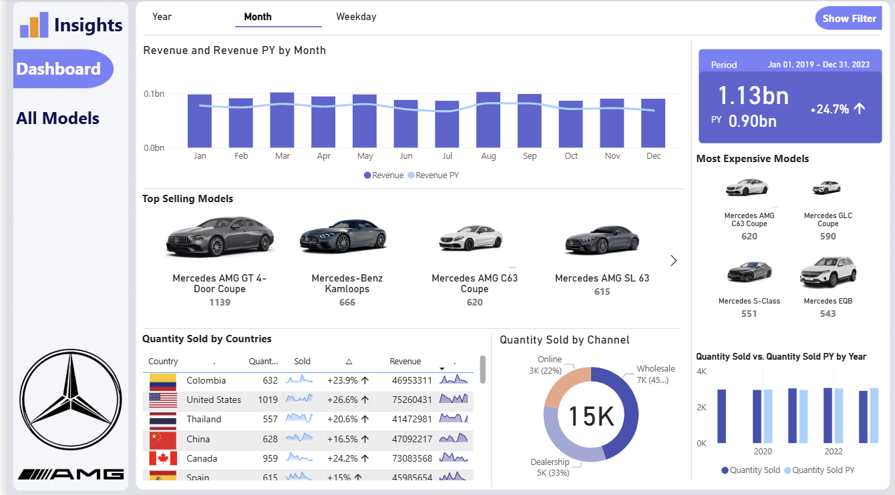

# Mercedes-Benz Sales Dashboard Project

Welcome to the **Mercedes-Benz Power BI Dashboard**! 🏎️📊
This project offers a powerful visual representation of Mercedes-Benz car sales data, covering multiple models and performance metrics. Designed as a portfolio project, it highlights my ability to transform raw data into business-ready dashboards using modern BI tools.

---

### 📊 Dashboard Overview

# This Power BI project includes:

- **Interactive Visuals**: *Dynamic dashboards showcasing sales trends, model-wise performance, and regional distribution.*

- **Data Analysis**: *In-depth insights into monthly/yearly sales, top-performing car models, and market share trends.*

- **User-Friendly Interface**: *Drill-down features, filters, and slicers that enhance user interactivity for both technical and non-technical users.*

- **KPIs and Metrics**: *Key performance indicators to monitor revenue, units sold, and top regions.*

---

## 🎯 This project is a strong representation of my skills in:

- **Data Visualization**

- **Business Intelligence**

- **Power BI Reporting**

- **Data Cleaning & Transformation**

- **Storytelling with Data**

- **Dashboard Design**

---
## 🛠️ Tools & Technologies Used:

- **Power BI Desktop**: *For building the interactive dashboard and data modeling.*
- **Microsoft Excel**: *Initial data cleaning and exploration.*
- **DAX (Data Analysis Expressions)**: *Used for creating calculated columns, measures, and KPIs.*
- **Power Query (M Language)**: *For ETL operations such as filtering, merging, and shaping data.*
- **GitHub**: *For version control and project documentation.*

---

## 🚗 Dataset Details

**Source**: Mercedes-Benz car sales dataset (CSV format)

**Scope**: Covers multiple car models and regions over a span of several years.

---
## Features Included:

- **Model Name**
- **Year**
- **Sales Volume**
- **Region**
- **Price Range**
- **Fuel Type**
- **Engine Size**

---
### 🧠 Insights Uncovered

- The dashboard helps answer key business questions:
- Which Mercedes-Benz model has the highest sales in the U.S. or globally?
- How are sales trends changing year over year?
- Which regions or states are leading in car purchases?
- Are luxury or affordable models more popular?
- What is the impact of fuel type or engine type on sales?
- These insights support strategic decisions in marketing, inventory planning, and product development.

---
### 📌 Project Objectives

-  **🎯 Business Goal**
    *Deliver a professional, interactive dashboard to visualize and monitor key Mercedes-Benz car sales trends for stakeholders and decision-makers.*

-  **🔍 Technical Goals**
    *Clean and transform raw sales data using Power Query.*

-  **Design a star schema data model inside Power BI.**

-  **Create insightful visualizations using charts, slicers, cards, and tables.**

-  **Build reusable KPIs using DAX functions.**

--- 

## 🙌 Let's Connect!
*If you liked this project or want to collaborate on future data analytics or BI dashboards, feel free to reach out:*
---
*Sincerely,*
Prince H. Pastakiya
[princepastakiya@gmail.com]
